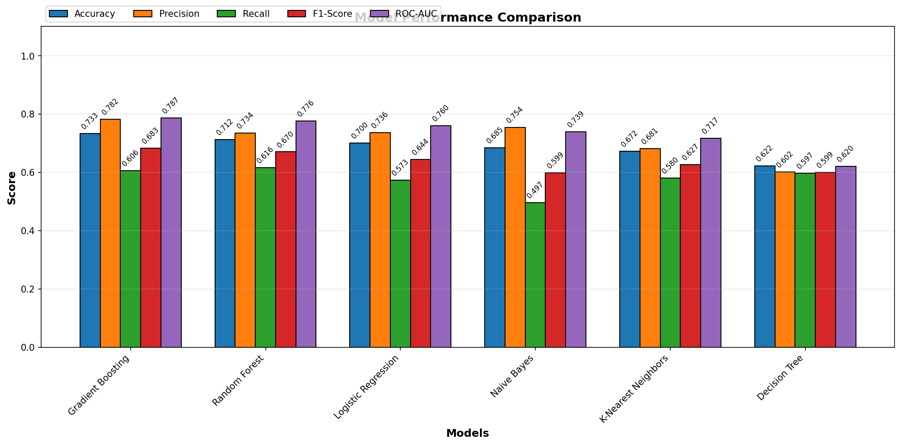
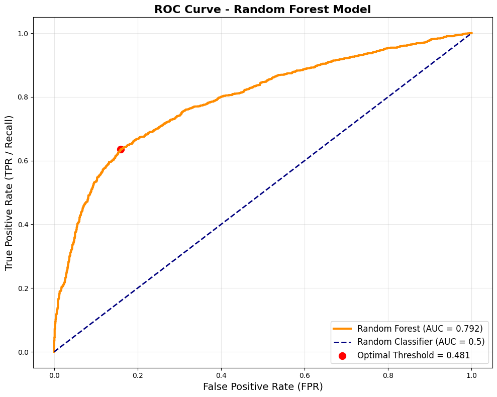
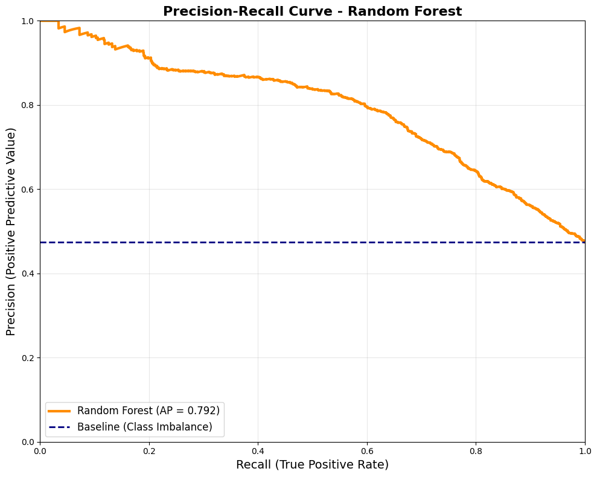
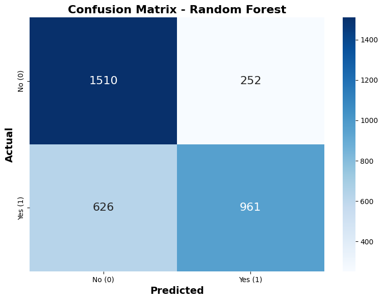
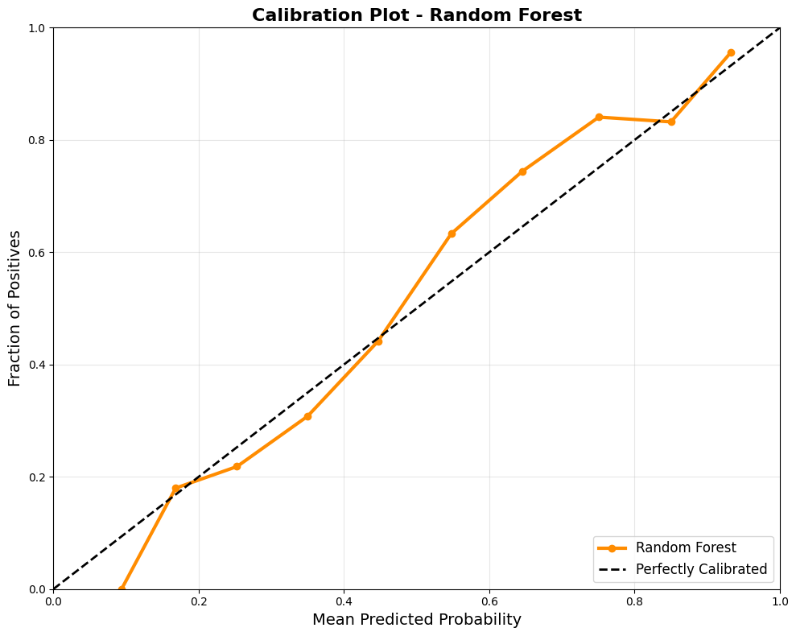

# Term Deposit Subscription Prediction

##### A supervised machine learning project that predicts which bank customers are likely to subscribe to a term deposit, built on direct telemarketing campaign data from a Portuguese banking institution. The model supports two concrete business goals — maximizing the number of subscribers found (customer acquisition) and minimizing wasted outreach (marketing budget optimization) — and compares seven classifiers before selecting a deployment model for each goal.

---

## Author

**Aleksandra Vislova**

[](https://www.linkedin.com/in/aleksandra-vislova-a51ba9297)

---

## Files in This Repository

| File / Folder | Description |
|---|---|
| `README.md` | Project overview, methodology, and results |
| `requirements.txt` | Python dependencies |
| `notebooks/01_EDA.ipynb` | Data extraction, cleaning, exploratory analysis, feature engineering, and encoding |
| `notebooks/02_models.ipynb` | Model training, comparison, selection, and evaluation |
| `data/processed/` | Encoded train/test features and labels (`X_train_encoded.csv`, `X_test_encoded.csv`, `y_train.csv`, `y_test.csv`) |
| `models/preprocessor.pkl` | Fitted `ColumnTransformer` (one-hot, ordinal, and scaling logic) for reuse at inference time |
| `models/acquisition_model.pkl` | Final Random Forest classifier selected for the customer-acquisition use case |
| `img/eda/` | Exploratory data analysis charts |
| `img/outputs/` | Model evaluation charts |

---

## Table of Contents

- [Project Background](#project-background)
- [Data Source](#data-source)
- [Methodology](#methodology)
- [Exploratory Data Analysis](#exploratory-data-analysis)
- [Modeling & Results](#modeling--results)
- [Business Recommendations](#business-recommendations)
- [Known Limitations](#known-limitations)
- [Summary](#summary)

---

## Project Background

Portuguese banking institutions run direct telemarketing campaigns to promote term deposit subscriptions — a call center contacts existing clients and offers them a term deposit product. Each call is costly, and not every client is equally likely to say yes. This project builds a classification model that predicts, **before a client is called**, how likely they are to subscribe, so the marketing team can prioritize outreach.

### Objectives
- Predict term deposit subscription (`deposit`: yes/no) from client demographic, financial, and campaign-contact attributes.
- Compare multiple classification algorithms on a consistent train/test split and metric set.
- Translate model performance into two distinct business strategies — acquisition-maximizing vs. budget-efficient — rather than a single "best" model.
- Ship a reusable preprocessing pipeline and a selected model so the recommendation can be deployed against new client lists.

---

## Data Source

| Source | Description |
|---|---|
| **OpenML / UCI Machine Learning Repository** | [Bank Marketing dataset (ID 43718)](https://www.openml.org/search?type=data&status=active&id=43718) |
| **Records** | 11,162 clients |
| **Features** | 16 input variables — demographic (age, job, marital status, education), financial (balance, housing loan, personal loan, default history), and campaign contact details (contact type, month, day, number of contacts, days since last contact, previous outcome) |
| **Target** | `deposit` — whether the client subscribed to a term deposit (`yes` / `no`) |

---

## Methodology

1. **Data extraction** — pulled directly from OpenML via the `openml` Python client.
2. **Data quality checks** — confirmed no missing values and checked for duplicate rows.
3. **Leakage prevention** — the `duration` column (call length) was dropped, since it's only known *after* a call ends and would leak future information into a model meant to prioritize calls *before* they happen.
4. **Feature engineering** — derived `was_contacted` (binary) from `pdays`, since `pdays = -1` is a sentinel meaning "never contacted before," not a numeric distance.
5. **Encoding** — a `ColumnTransformer` applies one-hot encoding to nominal features (job, marital status, default, housing, loan, contact type, month, previous outcome), ordinal encoding to `education`, and standard scaling to numeric features (age, balance, day, campaign, pdays, previous). The transformer was fit only on the training set and reused to transform the test set, avoiding data leakage. It's saved to `preprocessor.pkl` so new data can be encoded identically at inference time.
6. **Train/test split** — stratified 70/30 split (7,813 train / 3,349 test rows) to preserve the original class balance in both sets.
7. **Modeling** — seven classifiers trained and compared on identical splits: Naive Bayes, K-Nearest Neighbors, XGBoost, Logistic Regression, Decision Tree, Random Forest, and Gradient Boosting.
8. **Model selection** — rather than picking one "winner," the two top performers were mapped to two different business goals (see [Business Recommendations](#business-recommendations)).

---

## Exploratory Data Analysis

### 1. Target Distribution

The dataset is close to balanced: **5,873 clients (52.6%) did not subscribe, and 5,289 clients (47.4%) did subscribe** to a term deposit. This is a meaningfully different balance from the commonly-cited "bank-marketing" dataset (which is closer to 88/12) — this particular sample (OpenML ID 43718) is far more even, which is why plain accuracy is a reasonably informative metric here, though precision/recall still matter for the business trade-offs below.

*(`img/eda/target_distribution.png`)*

### 2. Categorical Feature Distributions

*(`img/eda/eda_categorical.png`)*

> This chart still needs a short description from you (or the image re-uploaded) — e.g. which job categories dominate, the split across marital status, month-of-contact seasonality, etc. — before I can write an accurate interpretation instead of a generic one.

### 3. Numeric Features vs. Target (Box Plots)

*(`img/eda/box_plots.png`)*

> Same note as above — I don't yet have this image's actual content to interpret honestly (e.g. whether `balance` or `campaign` visibly separates subscribers from non-subscribers). Share the image or the pattern you observed and I'll fill this in with real numbers rather than a guess.

---

## Modeling & Results

### Model Comparison



| Model | Accuracy | Precision | Recall | F1-Score | ROC-AUC |
|---|---|---|---|---|---|
| Gradient Boosting | 0.738 | **0.792** | 0.606 | 0.686 | **0.792** |
| Random Forest | 0.721 | 0.743 | **0.629** | 0.681 | 0.776 |
| XGBoost | 0.720 | 0.744 | 0.624 | 0.679 | 0.772 |
| Logistic Regression | 0.703 | 0.745 | 0.568 | 0.644 | 0.760 |
| Naive Bayes | 0.685 | 0.745 | 0.511 | 0.606 | 0.739 |
| K-Nearest Neighbors | 0.681 | 0.687 | 0.599 | 0.640 | 0.716 |
| Decision Tree | 0.624 | 0.606 | 0.592 | 0.599 | 0.623 |

**Key insight:** No single model dominates every metric. Gradient Boosting has the best precision and ROC-AUC; Random Forest has the best recall. Tree ensembles (Gradient Boosting, Random Forest, XGBoost) clearly outperform the simpler baselines (Naive Bayes, KNN, Decision Tree), which is expected given the mix of categorical and numeric features with non-linear interactions.

### ROC Curve



The curve shown reaches an AUC of 0.792 with an optimal threshold (by Youden's J statistic) of 0.481. **Note:** based on cross-checking these numbers against the table above, this AUC corresponds to **Gradient Boosting**, not Random Forest as the chart title states — see [`NOTEBOOK_REVIEW.md`](NOTEBOOK_REVIEW.md) for the full explanation and fix. Once corrected, expect the genuine Random Forest ROC-AUC to be closer to **0.776**.

### Precision-Recall Curve



Average Precision (AP) = 0.792, well above the class-imbalance baseline (~0.475, matching the actual "yes" proportion in the test set). Precision stays high (>0.85) up to roughly 20% recall, then degrades steadily — meaning the model can confidently flag a smaller set of highly-likely subscribers, but confidence drops as you push it to find more of them. Same caveat as above: this curve's AP matches Gradient Boosting's numbers, not Random Forest's.

### Confusion Matrix



| | Predicted No | Predicted Yes |
|---|---|---|
| **Actual No** | 1,510 (TN) | 252 (FP) |
| **Actual Yes** | 626 (FN) | 961 (TP) |

This gives accuracy 73.8%, precision 79.2%, recall 60.6% — again, these three figures match the Gradient Boosting row in the comparison table exactly, not Random Forest's row (72.1% / 74.3% / 62.9%). Business reading either way: **252 false positives** represent wasted outreach calls, and **626 false negatives** represent subscribers the campaign would have missed entirely.

### Calibration Plot



The model is reasonably well-calibrated in the mid-probability range (0.4–0.6, close to the diagonal), but overconfident at the low end (predicted probabilities around 0.1–0.2 correspond to an even lower actual positive rate) and slightly underconfident at the very top end. For a marketing use case where the raw probability score itself might be used to prioritize a call list (not just a yes/no cutoff), this is worth recalibrating (e.g. with Platt scaling or isotonic regression) before using scores as trustworthy probabilities.

---

## Business Recommendations

Two different business goals point to two different models:

| Goal | Recommended Model | Why |
|---|---|---|
| **Customer Acquisition** — find as many likely subscribers as possible | **Random Forest** | Highest recall (62.9%) — catches more true subscribers, at the cost of more false positives (wasted calls) |
| **Marketing Budget Optimization** — only call people who will likely say yes | **Gradient Boosting** | Highest precision (79.2%) — when it predicts "yes," it's right 4 times out of 5, minimizing wasted call volume |

The deployed model in this repository (`acquisition_model.pkl`) is the **Random Forest**, reflecting a customer-acquisition priority. If the business goal shifts toward budget efficiency, retrain and ship the Gradient Boosting model instead.

### Top Predictive Features (Random Forest)

Based on `feature_importances_` from the deployed model, the strongest predictors of subscription were the client's prior campaign outcome (`poutcome`), contact method, and account balance — consistent with the intuitive idea that clients who've responded well before, or who are reachable by cellular contact, are the best targets for a new campaign.

---

## Known Limitations

- **The ROC/PR/confusion-matrix/calibration plots in `models.ipynb` currently show Gradient Boosting's results mislabeled as Random Forest** — a variable-reuse bug, not a modeling error. Full root cause and fix in [`NOTEBOOK_REVIEW.md`](NOTEBOOK_REVIEW.md).
- `education`'s ordinal encoding currently ranks "unknown" above "tertiary," which isn't semantically correct and should be revisited.
- `preprocessor.pkl` was pickled under an older scikit-learn version and fails to load in newer environments (`_RemainderColsList` unpickling error) — pin the scikit-learn version in `requirements.txt` to match.
- No hyperparameter tuning was performed; all models use default or lightly-set parameters, so there's headroom left on the table for all seven models.

---

## Summary

| Metric | Value |
|---|---|
| **Dataset size** | 11,162 clients |
| **Target balance** | 52.6% no / 47.4% yes |
| **Train / test split** | 7,813 / 3,349 (stratified 70/30) |
| **Best precision** | Gradient Boosting (79.2%) |
| **Best recall** | Random Forest (62.9%) |
| **Deployed model** | Random Forest (`acquisition_model.pkl`), tuned for acquisition |

---

## Requirements

```
pandas
numpy
scikit-learn
xgboost
matplotlib
seaborn
openml
joblib
```
